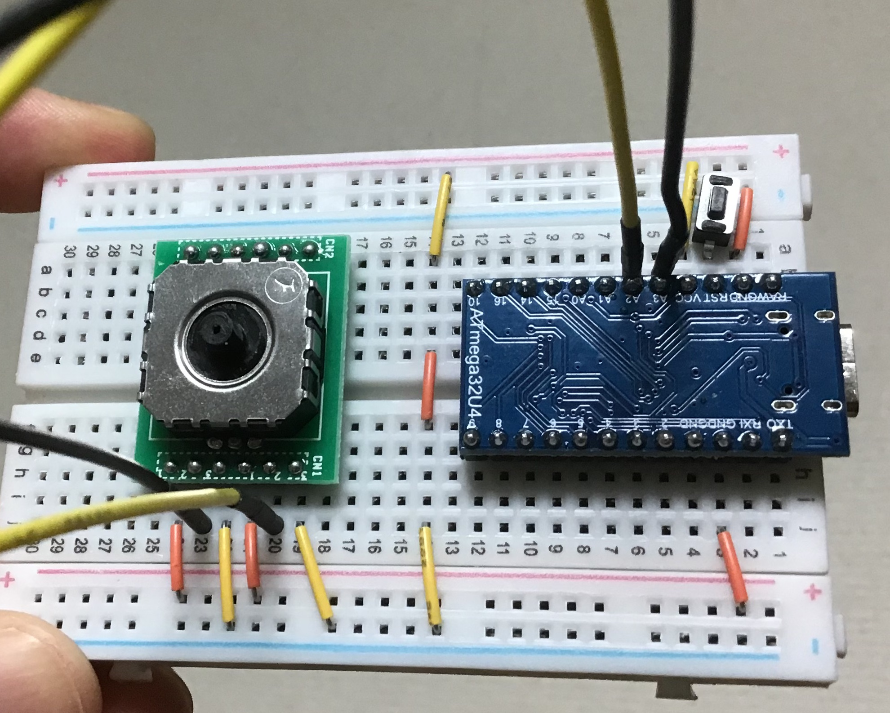

# joystick_slide

## 部品
- [アナログジョイスティック（秋月電子通商）](https://akizukidenshi.com/catalog/g/g104048/)
- [アナログジョイスティックDIP化キット（秋月電子通商）](https://akizukidenshi.com/catalog/g/g110263/)

## 参考
- [Pointing Device - Analog Joystick - qmk_firmwareドキュメント](https://docs.qmk.fm/#/feature_pointing_device?id=analog-joystick)
    - ジョイスティックをポインティングデバイスとして使うことについての公式ドキュメント
- [フルカラーLEDと秋月アナログジョイスティックDIP化キットをArduinoにつげてみた](http://blog.robo-takao.jp/blog-entry-179.html)
    - 秋月電子で購入できるスライド式ジョイスティックのピンの意味がわかる
- [秋月電子のアナログジョイスティックDIP化キットをArduinoとProcessingで使ってみた](http://blog.robo-takao.jp/blog-entry-177.html)
    - 同上
- [Analog Joystick on Arduino x Processing](https://www.youtube.com/watch?v=AEq2qJ_v0DE&ab_channel=TakaoRobo)
- [フルカラーLEDと秋月アナログジョイスティックDIP化キットをArduinoにつげてみた](https://www.youtube.com/watch?v=B-9mlMgNQ3E&ab_channel=TakaoRobo)
- [takashicompanyさんのソース](https://github.com/takashicompany/qmk_firmware/commit/e2d32adbfb674da40660be166466cc3b1578c413)
